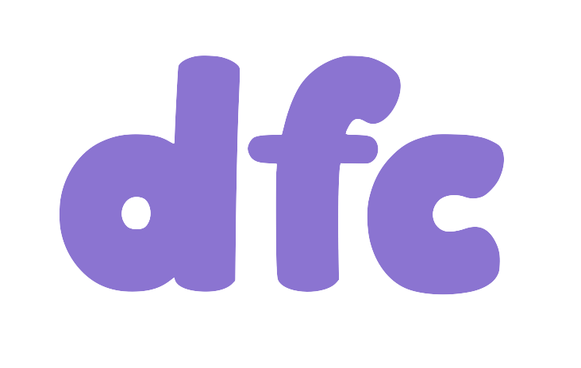

# dfc

<p align="center">

</p>

<p align="center">
<b><code>d</code>ocker<code>f</code>ile <code>c</code>onverter</b>

<p align="center">CLI to convert Dockerfiles to use Chainguard Images and APKs in FROM and RUN lines etc.</p>

</p>

---
## About

The `dfc` tool helps you migrate your Dockerfiles to use Chainguard Images. For comprehensive guides on migration, check out:
- [Dockerfile Conversion Guide](https://edu.chainguard.dev/chainguard/migration/dockerfile-conversion/)
- [Chainguard Migration Overview](https://edu.chainguard.dev/chainguard/migration/migrations-overview/)

## Installation

You can install `dfc` from Homebrew:

```sh
brew install chainguard-dev/tap/dfc
```

You can also install `dfc` from source:

```sh
go install github.com/chainguard-dev/dfc@latest
```

You can also use the `dfc` container image (from Docker Hub or `cgr.dev`):

```sh
docker run --rm -v "$PWD":/work chainguard/dfc
docker run --rm -v "$PWD":/work cgr.dev/chainguard/dfc
```

## Usage

Convert Dockerfile and print converted contents to terminal:

```sh
dfc ./Dockerfile
```

Save the output to new Dockerfile called `Dockerfile.chainguard`:

```sh
dfc ./Dockerfile > ./Dockerfile.chainguard
```

You can also pipe from stdin:

```sh
cat ./Dockerfile | dfc -
```

Convert the file in-place using `--in-place` / `-i` (saves backup in `.bak` file):

```sh
dfc --in-place ./Dockerfile
mv ./Dockerfile.bak ./Dockerfile # revert
```

Note: the `Dockerfile` and `Dockerfile.chainguard` in the root of this repo are not actually for building `dfc`, they
are symlinks to files in the [`testdata/`](./testdata/) folder so users can run the commands in this README.

## Examples

For complete before and after examples, see the [`testdata/`](./testdata/) folder.

### Convert a single `FROM` line

```sh
echo "FROM node" | dfc -
```

Result:

```Dockerfile
FROM cgr.dev/ORG/node:latest-dev
```

### Convert a single `RUN` line

```sh
echo "RUN apt-get update && apt-get install -y nano" | dfc -
```

Result:

```Dockerfile
RUN apk add --no-cache nano
```

### Convert a whole Dockerfile

```sh
cat <<DOCKERFILE | dfc -
FROM node
RUN apt-get update && apt-get install -y nano
DOCKERFILE
```

Result:

```Dockerfile
FROM cgr.dev/ORG/node:latest-dev
USER root
RUN apk add --no-cache nano
```

## Supported platforms

`dfc` detects the package manager being used and maps this to
a supported distro in order to properly convert RUN lines.
The following platforms are recognized:

| OS                           | Package manager            |
| ---------------------------- | -------------------------- |
| Alpine ("alpine")            | `apk`                      |
| Debian/Ubuntu ("debian")     | `apt-get` / `apt`          |
| Fedora/RedHat/UBI ("fedora") | `yum` / `dnf` / `microdnf` |


## Configuration

### Chainguard org (cgr.dev namespace)

By default, FROM lines that have been mapped to Chainguard images will use "ORG" as a placeholder under `cgr.dev`:

```Dockerfile
FROM cgr.dev/ORG/<image>
```

To configure your `cgr.dev` namespace use the `--org` flag:

```
dfc --org="example.com" ./Dockerfile
```

Resulting in:

```Dockerfile
FROM cgr.dev/example.com/<image>
```

If mistakenly ran `dfc` with no configuration options and just want to replace the ORG
in the converted file, you can run something like this:

```sh
sed "s|/ORG/|/example.com/|" ./Dockerfile > dfc.tmp && mv dfc.tmp ./Dockerfile
```

### Alternate registry

To use an alternative registry domain and root namespace, use the `--registry` flag:

```
dfc --registry="r.example.com/cgr-mirror" ./Dockerfile
```

Resulting in:

```Dockerfile
FROM r.example.com/cgr-mirror/<image>
```

Note: the `--registry` flag takes precedence over the `--org` flag.

### Custom mappings file

If you need to supply extra image or package mappings, use the `--mappings` flag:

```sh
dfc --mappings="./custom-mappings.yaml" ./Dockerfile
```

By default, custom mappings specified with `--mappings` will overlay the built-in mappings found in [`pkg/dfc/builtin-mappings.yaml`](./pkg/dfc/builtin-mappings.yaml). If you wish to bypass the built-in mappings entirely and only use your custom mappings, use the `--no-builtin` flag:

```sh
dfc --mappings="./custom-mappings.yaml" --no-builtin ./Dockerfile
```

### Updating Built-in Mappings

The `--update` flag is used to update the built-in mappings in a local cache from the latest version available in the repository:

```sh
dfc --update
```

You can use this flag as a standalone command to update mappings without performing any conversion, or combine it with a conversion command to ensure you're using the latest mappings:

```sh
dfc --update ./Dockerfile
```

When combined with a conversion command, the update check is performed prior to running the conversion, ensuring your conversions use the most up-to-date mappings available.

### Submitting New Built-in Mappings

If you'd like to request new mappings to be added to the built-in mappings file, please [open a GitHub issue](https://github.com/chainguard-dev/dfc/issues/new?template=BLANK_ISSUE).

Note that the `builtin-mappings.yaml` file is generated via internal automation and cannot be edited directly. Your issue will be reviewed by the maintainers, and if approved, the mappings will be added to the internal automation that generates the built-in mappings.

### Configuration Files and Cache

`dfc` follows the XDG specification for configuration and cache directories:

- **XDG_CONFIG_HOME**: Stores configuration files, including a symlink to `builtin-mappings.yaml`. By default, this is `~/.config/dev.chainguard.dfc/` (on macOS: `~/Library/Application\ Support/dev.chainguard.dfc/`).
- **XDG_CACHE_HOME**: Stores cached data following the [OCI layout specification]((https://github.com/opencontainers/image-spec/blob/main/image-layout.md). By default, this is `~/.cache/dev.chainguard.dfc/` (on macOS: `~/Library/Caches/dev.chainguard.dfc/`).

Note: `dfc` does not make any network requests unless the `--update` flag is provided. However, `dfc` will perform a syscall to check for the existence of the `builtin-mappings.yaml` file (symlink) in the XDG_CONFIG directory.

## How it works

### `FROM` line modifications

For each `FROM` line in the Dockerfile, `dfc` attempts to replace the base image with an equivalent Chainguard Image.

### `RUN` line modifications

For each `RUN` line in the Dockerfile, `dfc` attempts to detect the use of a known package manager (e.g. `apt-get` / `yum` / `apk`), extract the names of any packages being installed, try to map them via the package mappings in [`mappings.yaml`](./mappings.yaml), and replacing the old install with  `apk add --no-cache <packages>`.

### `USER` line modifications

If `dfc` has detected the use of a package manager and ended up converting a RUN line,
then `USER root` will be appended under the last `FROM` line.

In the future we plan to handle this more elegantly, but this is the current state.

### `ARG` line modifications

For each `ARG` line in the Dockerfile, `dfc` checks if the ARG is used as a base image in a subsequent `FROM` line. If it is, and the ARG has a default value that appears to be a base image, then `dfc` will modify the default value to use a Chainguard Image instead.

## Special considerations

### Busybox command syntax

#### useradd/groupadd vs. adduser/addgroup

Since adding users and groups in Chainguard Images in Dockerfiles requires
`adduser` / `addgroup` (via busybox), when we detect the use of
`useradd` or `groupadd` commands in `RUN` lines, we will automatically try to
convert them to the equivalent `adduser` / `addgroup` commands.

If we see that you have installed the `shadow` package
(which actually provides `useradd` and `groupadd`), then we do not modify
these commands and leave them as is.

#### tar command

The syntax for the `tar` command is slightly different in busybox than it is
in the GNU version which is present by default on various distros.

For that reason, we will attempt to convert `tar` commands in `RUN` lines
using the GNU syntax to use the busybox syntax instead.

## Base image and tag mapping

When converting Dockerfiles, `dfc` applies the following logic to determine which Chainguard Image and tag to use:

### Base Image Mapping
- Image mappings are defined in the `mappings.yaml` file under the `images` section
- Each mapping defines a source image name (e.g., `ubuntu`, `nodejs`) and its Chainguard equivalent
- Glob matching is supported using the asterisk (*) wildcard (e.g., `nodejs*` matches both `nodejs` and `nodejs20-debian12`)
- If a mapping includes a tag (e.g., `chainguard-base:latest`), that tag is always used
- If no tag is specified in the mapping (e.g., `node`), tag selection follows the standard tag mapping rules
- If no mapping is found for a base image, the original name is preserved and tag mapping rules apply
- Docker Hub images with full domain references (e.g., `docker.io/library/node`, `index.docker.io/library/node`) are normalized before mapping by removing the domain and `library/` prefix, which allows them to match against the simple image name entries in mappings.yaml

### Tag Mapping
The tag conversion follows these rules:

1. **For chainguard-base**:
   - Always uses `latest` tag, regardless of the original tag or presence of RUN commands

2. **For tags containing ARG variables** (like `${NODE_VERSION}`):
   - Preserves the original variable reference
   - Adds `-dev` suffix only if the stage contains RUN commands
   - Example: `FROM node:${NODE_VERSION}` → `FROM cgr.dev/ORG/node:${NODE_VERSION}-dev` (if stage has RUN commands)

3. **For other images**:
   - If no tag is specified in the original Dockerfile:
     - Uses `latest-dev` if the stage contains RUN commands
     - Uses `latest` if the stage has no RUN commands
   - If a tag is specified:
     - If it's a semantic version (e.g., `1.2.3` or `v1.2.3`):
       - Truncates to major.minor only (e.g., `1.2`)
       - Adds `-dev` suffix only if the stage contains RUN commands
     - If the tag starts with `v` followed by numbers, the `v` is removed
     - For non-semver tags (e.g., `alpine`, `slim`):
       - Uses `latest-dev` if the stage has RUN commands
       - Uses `latest` if the stage has no RUN commands

This approach ensures that:
- Development variants (`-dev`) with shell access are only used when needed
- Semantic version tags are simplified to major.minor for better compatibility
- The final stage in multi-stage builds uses minimal images without dev tools when possible
- Build arg variables in tags are preserved with proper `-dev` suffix handling

### Examples
- `FROM node:14` → `FROM cgr.dev/ORG/node:14-dev` (if stage has RUN commands)
- `FROM node:14.17.3` → `FROM cgr.dev/ORG/node:14.17-dev` (if stage has RUN commands)
- `FROM debian:bullseye` → `FROM cgr.dev/ORG/chainguard-base:latest` (always)
- `FROM golang:1.19-alpine` → `FROM cgr.dev/ORG/go:1.19` (if stage has RUN commands)
- `FROM node:${VERSION}` → `FROM cgr.dev/ORG/node:${VERSION}-dev` (if stage has RUN commands)

## JSON mode

Get converted Dockerfile as JSON using `--json` / `-j`:

```sh
dfc --json ./Dockerfile
```

Pipe it to `jq`:

```sh
dfc -j ./Dockerfile | jq
```

### Useful jq formulas

Reconstruct the Dockerfile pre-conversion:

```sh
dfc -j ./Dockerfile | jq -r '.lines[]|(.extra + .raw)'
```

Reconstruct the Dockerfile post-conversion:

```sh
dfc -j ./Dockerfile | jq -r '.lines[]|(.extra + (if .converted then .converted else .raw end))'
```

Convert and strip comments:

```sh
dfc -j ./Dockerfile | jq -r '.lines[]|(if .converted then .converted else .raw end)'
```

Get list of all distros detected from RUN lines:

```sh
dfc -j ./Dockerfile | jq -r '.lines[].run.distro' | grep -v null | sort -u
```

Get list of package managers detected from RUN lines:

```sh
dfc -j ./Dockerfile | jq -r '.lines[].run.manager' | grep -v null | sort -u
```

Get all the packages initially detected during parsing:

```sh
dfc -j ./Dockerfile | jq -r '.lines[].run.packages' | grep '"' | cut -d'"' -f 2 | sort -u | xargs
```

## Using from Go

The package `github.com/chainguard-dev/dfc/pkg/dfc` can be imported in Go and you can
parse and convert Dockerfiles on your own without the `dfc` CLI:

```go
package main

import (
	"context"
	"fmt"
	"log"
	"path/filepath"
	"strings"

	"github.com/chainguard-dev/dfc/pkg/dfc"
)

var (
	raw = []byte(strings.TrimSpace(`
		FROM node
		RUN apt-get update && apt-get install -y nano
	`))

	org = "example.com"
)

func main() {
	ctx := context.Background()

	// Parse the Dockefile bytes
	dockerfile, err := dfc.ParseDockerfile(ctx, raw)
	if err != nil {
		log.Fatalf("ParseDockerfile(): %v", err)
	}

	// Convert
	converted, err := dockerfile.Convert(ctx, dfc.Options{
		Organization: org,
		// Registry: "r.example.com/cgr-mirror", // Optional: registry override
		// Update:   true,                      // Optional: update mappings before conversion
		// ExtraMappings: myCustomMappings,     // Optional: overlay mappings on top of builtin
		// NoBuiltIn: true,                     // Optional: skip built-in mappings
	})
	if err != nil {
		log.Fatalf("dockerfile.Convert(): %v", err)
	}

	// Print converted Dockerfile content
	fmt.Println(converted)
}
```

### Custom Base Image Conversion

You can customize how base images are converted by providing a `FromLineConverter` function. This example shows how to handle internal repository images differently while using the default Chainguard conversion for other images:

```go
package main

import (
	"context"
	"fmt"
	"log"
	"path/filepath"
	"strings"

	"github.com/chainguard-dev/dfc/pkg/dfc"
)

func main() {
	ctx := context.Background()

	// Sample Dockerfile with multiple FROM lines
	raw := []byte(strings.TrimSpace(`
		FROM node:14
		RUN npm install

		FROM internal-repo.example.com/python:3.9
		COPY --from=0 /app/node_modules /app/node_modules
		RUN pip install -r requirements.txt
	`))

	// Parse the Dockerfile
	dockerfile, err := dfc.ParseDockerfile(ctx, raw)
	if err != nil {
		log.Fatalf("ParseDockerfile(): %v", err)
	}

	// Define a custom converter that:
	// 1. For internal repository images, adds basename as a suffix to the tag
	// 2. For all other images, uses the default Chainguard conversion
	// 3. Appends "-dev" suffix to tags when the stage contains RUN commands
	customConverter := func(from *dfc.FromDetails, converted string, stageHasRun bool) (string, error) {
		// Check if this is an internal repository image
		if strings.Contains(from.Orig, "internal-repo") {
			// Extract the image basename
			basename := filepath.Base(from.Base)

			// Extract tag part if present
			tagPart := ""
			if from.Tag != "" {
				tagPart = from.Tag
			} else {
				tagPart = "latest"
			}

			// Add -dev suffix if the stage has a RUN command and the tag doesn't already have it
			if stageHasRun && !strings.HasSuffix(tagPart, "-dev") {
				tagPart += "-dev"
			}

			// For internal images, we maintain the internal repo but add our org
			// and image basename as a suffix to the tag
			return fmt.Sprintf("internal-repo.example.com/%s:%s-my-org-%s", 
				from.Base, tagPart, basename), nil
		}

		// For all other images, use the default Chainguard conversion
		return converted, nil
	}

	// Convert with custom image conversion
	converted, err := dockerfile.Convert(ctx, dfc.Options{
		Organization:      "my-org",
		FromLineConverter: customConverter,
	})
	if err != nil {
		log.Fatalf("dockerfile.Convert(): %v", err)
	}

	// Print the results
	fmt.Println("Original Dockerfile:")
	fmt.Println(string(raw))
	fmt.Println("\nConverted Dockerfile:")
	fmt.Println(converted)
}
```

Example output:
```
Original Dockerfile:
FROM node:14
RUN npm install

FROM internal-repo.example.com/python:3.9
COPY --from=0 /app/node_modules /app/node_modules
RUN pip install -r requirements.txt

Converted Dockerfile:
FROM cgr.dev/my-org/node:14-dev
USER root
RUN apk add --no-cache npm
RUN npm install

FROM internal-repo.example.com/python:3.9-my-org-python
USER root
COPY --from=0 /app/node_modules /app/node_modules
RUN apk add --no-cache pip
RUN pip install -r requirements.txt
```

This approach gives you full control over image reference conversion while preserving DFC's package manager and command conversion capabilities.

## Limitations

- **Incomplete Conversion**: The tool makes a best effort to convert Dockerfiles but does not guarantee that the converted Dockerfiles will be buildable by Docker.
- **Comment and Spacing Preservation**: While the tool attempts to preserve comments and spacing, there may be cases where formatting is altered during conversion.
- **Dynamic Variables**: The tool may not handle dynamic variables in Dockerfiles correctly, especially if they are used in complex expressions.
- **Unsupported Directives**: Some Dockerfile directives may not be fully supported or converted, leading to potential build issues.
- **Package Manager Commands**: The tool focuses on converting package manager commands but may not cover all possible variations or custom commands.
- **Multi-stage Builds**: While the tool supports multi-stage builds, it may not handle all edge cases, particularly with complex stage dependencies.
- **Platform-Specific Features**: The tool may not account for platform-specific features or optimizations in Dockerfiles.
- **Security Considerations**: The tool does not perform security checks on the converted Dockerfiles, and users should review the output for potential vulnerabilities.

## Contact Us

For issues related strictly to `dfc` as an open source tool,
please [open a GitHub issue](https://github.com/chainguard-dev/dfc/issues/new?template=BLANK_ISSUE).

Chainguard customers: please share issues or feature requests with
your support contact so we can prioritize and escalate internally
(with or without a GitHub issue/PR).

Interested in Chainguard Images and want to get in touch with sales? Use [this form](https://www.chainguard.dev/contact).
